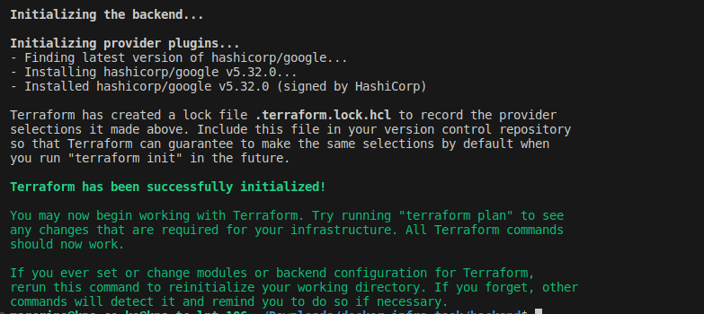

## Database Setup
- Create MySQL database in GCP
- The database is called "test"
- Create a firewall rule for the database to open port 3306 to allow connnection

## Application Setup
- Test both frontend and backend locally

## Backend Setup and Testing
- Dockerize the backend application
- Test the docker image

## Frontend Setup and Testing
- Dockerize the frontend application
- Test the docker image

## Artifact Repository
- Create A repository in GCP
- For security purposes this can be a private repository
- This is where all images will be pushed 


## IaC
- Terraform will be used to provision the infrastructure on GCP
- That is the cloud run
- Create terraform file as `main.tf`
### NOTE :
```
Ensure you create necessary roles to enable terraform to create resources in the specified account.

```
- Using the gcloud command you can create the service account as shown below
 `gcloud iam service-accounts create test --display-name "Test Service Account"`

- Attach a role as below
`gcloud projects add-iam-policy-binding YOUR_PROJECT_ID --member "serviceAccount:test@YOUR_PROJECT_ID.iam.gserviceaccount.com" --role "roles/editor"`

- Copy the service account credentials
`gcloud iam service-accounts keys create ~/test-key.json --iam-account test@YOUR_PROJECT_ID.iam.gserviceaccount.com`

- After all the above, then you can run the terraform script

- commands to run terraform are as below:
`terraform init`


- The above command will initialize terraform

`terraform plan`


- The command above will give you a view of the resources that will be provisioned in GCP

`terraform apply`


- The command above will deploy the resources. In this case cloud run


## Testing
- after deployment to cloudrun now we test
- The cloudrun provides a public url to access the application


## Create a CI/CD Pipeline to GCP Cloud Run
- For the CI/CD we will use github actions (Find the workflows in .github/workflows for both backend and frontend)
- The workflow will update images and push the image to cloudrun for deployment


